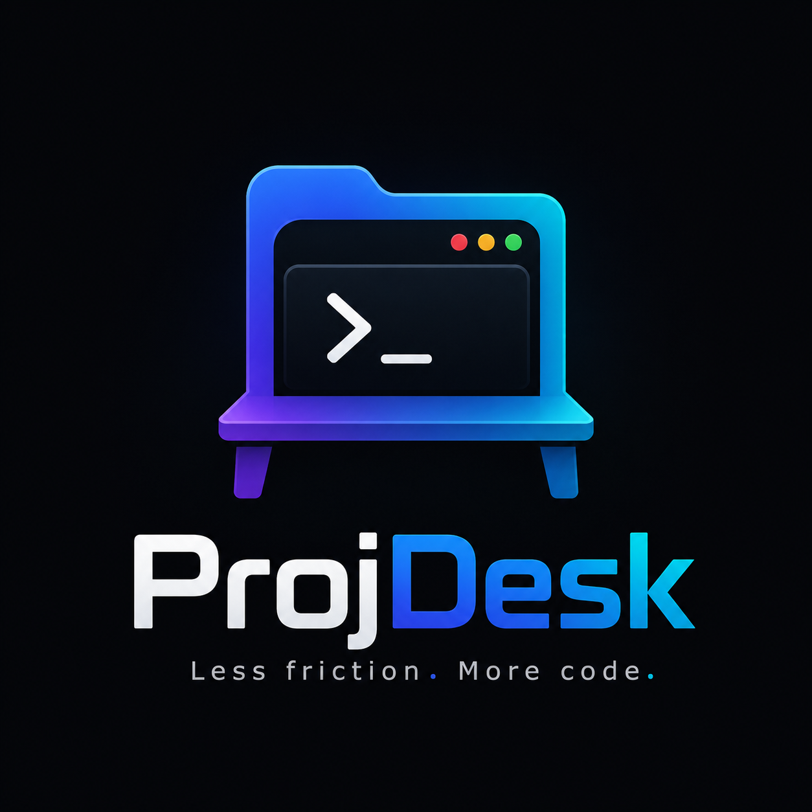

<p align="center">
  
</p>

<h1 align="center">ProjDesk</h1>

<p align="center">
  <i>Less friction. More code.</i>
</p>

<p align="center">
  
  
  
  
</p>

ProjDesk is an intelligent workspace manager for WSL. It turns the repetitive startup ritual of every development session into a single command:

```bash
pd my-project
```

Instead of manually navigating to a project, opening the right IDE, and remembering whether Docker needs to run, ProjDesk detects what the project needs and gets out of your way.

```bash
# Instead of this:
cd ~/projects/my-project
code .
docker compose up -d

# Just this:
pd my-project
```

`pd` is the short alias — `projdesk` works everywhere too:

```bash
projdesk my-project
projdesk r ls
```

## Table of Contents

- [Features](#features)
- [Command Reference](#command-reference)
- [How It Works](#how-it-works)
- [Design Principles](#design-principles)
- [Architecture](#architecture)
- [Requirements](#requirements)
- [Installation](#installation)
- [Configuration](#configuration)
- [Roadmap](#roadmap)
- [License](#license)

## Features

**Workspace management**
- Create projects automatically — `pd name` creates the folder if it doesn't exist
- Jump into any workspace from anywhere
- List all projects in your workspace
- Jump back into recently used projects — `pd recent` (alias: `pd r`)

**Smart IDE integration**
- Opens Visual Studio Code by default
- Detects Android (Gradle) and Flutter projects and opens Android Studio automatically
- Launch Android Studio's New Project wizard with `pd a`

**Docker lifecycle**
- Starts Docker automatically when a project needs it (Docker Engine in WSL or Docker Desktop)
- Detects Docker Compose projects (`docker-compose.yml`, `compose.yml`, …)
- Start, rebuild, stop, and tail logs in one command
- Honors `docker-compose.dev.yml` overrides when present

**Developer experience**
- Bash autocomplete for project names and commands
- Modular, lightweight shell-only codebase (no dependencies)
- No prompts when the answer can be detected

## Command Reference

Commands follow a progressive refinement structure: **Noun → Verb → Modifier**. Each argument narrows intent. Commands that reward learning have documented single-letter aliases.

### Workspace Commands

| Command | Alias | Description |
| --- | --- | --- |
| `pd <project>` | | Open or create a project in VS Code |
| `pd a` | `pd -a` | Open Android Studio's New Project wizard |
| `pd list` | `pd ls` | List all projects in the workspace |
| `pd recent` | `pd r` | Open the most recently used project |
| `pd recent list` | `pd r ls` | List the last 10 used projects |

### Environment Commands

| Command | Alias | Description |
| --- | --- | --- |
| `pd up` | | Start Docker and bring up Compose services |
| `pd rebuild` | | Rebuild and restart Compose services |
| `pd down` | | Stop Compose services |
| `pd logs` | | Tail Compose service logs |

## How It Works

### The Semantic Command Tree

ProjDesk is not a flat list of scripts. It is a **semantic command tree** built on progressive refinement:

```
Noun → Verb → Modifier
```

- `pd` — the workspace (noun, implicit)
- `pd up` — refine to an action (verb): start the environment
- `pd a` — refine further (modifier): Android, specifically — opens Android Studio's New Project wizard

The tool adapts to your intent. You never tell it *how* to open a project; you tell it *which* project, and ProjDesk figures out the rest.

### Alias as a Reward

Full words are for discovery. Aliases are for speed. Every documented command ships with a shorthand so that experienced users can move faster:

```
pd list        →  pd ls
```

Learning the tool pays off in fewer keystrokes, not fewer features.

## Design Principles

- **No prompts when it can be automated.** If ProjDesk can detect a project type, it opens the right IDE instead of asking.
- **Silent success, loud failure.** When `pd up` works, it starts the containers and gets out of the way. When it fails, the message is clear and actionable.
- **Graceful degradation.** If an automation can't run (e.g., Docker isn't available), ProjDesk says so in human terms and suggests the next step.
- **The project decides, not you.** Detection replaces decision-making. Docker Compose projects start Docker; Android projects open Android Studio.

## Architecture

ProjDesk is strictly modular. Every file in `src/` has one job and stays small:

| Module | Responsibility |
| --- | --- |
| `init.sh` | Entry point. Registers the `pd` function and loads all modules |
| `config.sh` | Global configuration (`PROJECTS_DIR`, `DOCKER_MODE`, `DOCKER_EXE`, `AUTO_OPEN_CODE`) |
| `project.sh` | Router and workspace manipulator — parses the semantic tree and dispatches commands |
| `detect.sh` | Sensory layer — inspects the filesystem for Docker Compose and mobile projects |
| `docker.sh` | Docker lifecycle — backend-aware auto-start (WSL engine or Desktop), up, rebuild, down, logs |
| `completion.sh` | Bash autocomplete for project names |

```
src/
├── init.sh          # entry point: registers pd() and sources modules
├── config.sh        # user configuration
├── detect.sh        # project detection (compose, gradle, flutter)
├── docker.sh        # docker engine (wsl/desktop) + compose lifecycle
├── project.sh       # command router + workspace actions
└── completion.sh    # bash completion
```

## Requirements

- **WSL** (the `desktop` backend uses Windows interop via `powershell.exe`)
- **Bash 5+**
- **VS Code** with the `code` CLI available in `PATH`
- **Android Studio** at `~/android-studio/bin/studio.sh` (for Android/Flutter projects)
- **Docker** — Docker Engine installed natively in WSL (`DOCKER_MODE=wsl`) or Docker Desktop on Windows (`DOCKER_MODE=desktop`)

## Installation

### Using the installer

```bash
git clone <repository-url> ~/.config/projdesk
~/.config/projdesk/install.sh
```

The installer adds the `source` line to your `~/.bashrc` automatically. Restart your terminal or reload your shell:

```bash
source ~/.bashrc
```

### Manual setup

```bash
git clone <repository-url> ~/.config/projdesk
```

Add this line to your `~/.bashrc`:

```bash
source ~/.config/projdesk/src/init.sh
```

Then reload:

```bash
source ~/.bashrc
```

## Configuration

Configuration lives in `src/config.sh`. Copy `src/config.example.sh` and adjust to taste:

| Variable | Default | Description |
| --- | --- | --- |
| `PROJECTS_DIR` | `$HOME/projects` | Base directory for all projects |
| `DOCKER_EXE` | `C:\Program Files\Docker\Docker\Docker Desktop.exe` | Path to the Docker Desktop executable (`desktop` mode) |
| `DOCKER_MODE` | `desktop` | `wsl` = native Docker Engine in WSL · `desktop` = Docker Desktop on Windows |
| `AUTO_OPEN_CODE` | `true` | Open the IDE automatically when entering a project |
| `AUTO_START_CONTAINERS` | `false` | Bring up Compose services automatically when opening a project |
| `RECENT_FILE` | `$HOME/.config/projdesk/recent` | History file for recently used projects |

## Testing

| Command | What it does |
| --- | --- |
| `make lint` | Static analysis with [ShellCheck](https://www.shellcheck.net) |
| `make test` | Run test suite with [BATS](https://github.com/bats-core/bats-core) |
| `make install-hook` | Install a `pre-push` hook that runs lint + tests before every push |

Tests run in isolated temporary directories — no real Docker, no system `.bashrc`, no Android Studio.

## Roadmap

### Implemented

- [x] Workspace navigation and automatic project creation
- [x] VS Code integration
- [x] Android Studio integration with Android/Flutter detection
- [x] Docker auto-start (WSL engine or Docker Desktop)
- [x] Docker Compose lifecycle (up, rebuild, down, logs)
- [x] Bash autocomplete for projects and commands
- [x] Recent projects history (`pd recent` / `pd r`)
- [x] Modular `src/` architecture
- [x] BATS test suite + ShellCheck lint + CI (GitHub Actions)

### Coming next

- [ ] `pd doctor` — diagnostics and auto-fix for dependencies
- [ ] `pd help` — command map mirroring the semantic tree
- [ ] Automatic language detection
- [ ] IntelliJ IDEA, PyCharm, WebStorm, and Rider support
- [ ] Project templates
- [ ] Git repository initialization
- [ ] Plugin system
- [ ] Interactive mode
- [ ] Workspace profiles

## License

[MIT](LICENSE) © Gabriel Pablo Garcia
